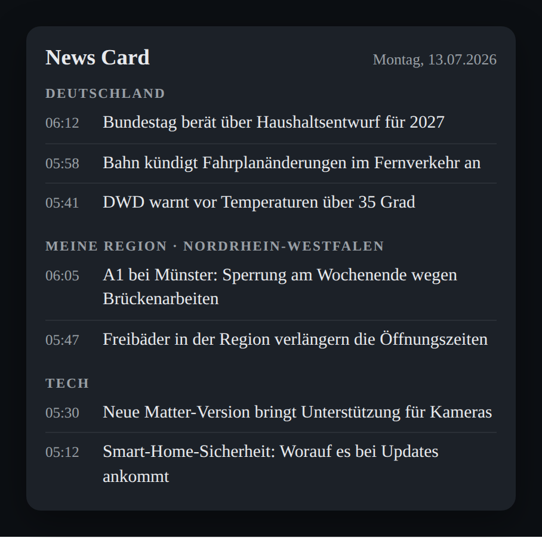
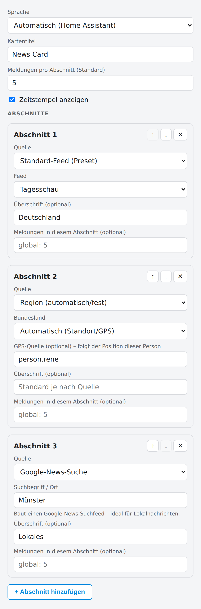

# 📰 News Card

A news card for your Home Assistant dashboard. It shows the top national and
regional headlines every morning – with **built-in feeds** (presets incl.
Google News), **automatic region detection** from the HA location or GPS,
**Google News search feeds** for any place or topic, **custom RSS links**, and
support for **existing feed sensors** if you already use RSS in Home Assistant.

News Card is a **Home Assistant integration**: it loads the feeds
**server-side**, so the browser never runs into CORS blocks, and it **ships the
Lovelace card and registers it automatically**. One install gives you both the
data and the card – no manual sensors, no YAML, no CORS workarounds.

The interface is available in **English and German** and follows your Home
Assistant language automatically (override with the `language` option).

<p align="center">
  
  &nbsp;&nbsp;
  
</p>

<p align="center"><em>The card on a dashboard (left) and its visual editor (right).</em></p>

## Configure without YAML: the visual editor

The card ships a **graphical settings menu** – YAML is optional.
Dashboard → Edit → Add card → "News Card", or click the **gear** on an existing
card. Everything can be set with clicks and input fields:

- **Language** (Automatic / English / Deutsch), **card title**, **headlines per
  section**, and **timestamps** on/off
- add, remove and reorder **sections** with ↑/↓
- pick each section's **source** from a list: standard feed (preset), region
  (auto/fixed), Google News search, custom RSS link, or an existing sensor –
  the matching fields appear automatically
- sensor and tracker fields suggest matching entities from your instance

The YAML reference below is only needed if you prefer configuring in code.

## Five ways to define a source

Each entry in `sections` gets its news one of five ways – a dropdown in the
editor, a key in YAML:

```yaml
type: custom:news-card
title: News Card
max_items: 5
sections:
  - preset: tagesschau            # 1. built-in standard feed
  - region: auto                  # 2. federal state from the HA location
                                  #    (see below)
  - title: Local                  # 3. Google News search for a place/term
    google: "Münster"             #    (great for local news)
  - title: Tech                   # 4. custom RSS/Atom link
    url: https://www.heise.de/rss/heise-atom.xml
  - title: Business               # 5. existing sensor (e.g. Feedparser),
    entity: sensor.my_feed        #    if you already use RSS in HA
```

## Automatic region (`region:`)

`region: auto` determines the federal state from the **Home Assistant location**
(Settings → System → General) and picks the matching regional feed – an ARD
preset where available, otherwise the Google News search feed for that state.
Matching happens entirely locally in the card; no location data is sent to
third parties.

```yaml
- region: auto                # federal state from the HA location
- region: auto
  tracker: person.rene        # …or follow a person's GPS position
- region: bayern              # …or set it fixed (overrides the automatic one)
```

- **GPS mode:** with `tracker:` the region follows the person – on holiday in
  Munich the card shows Bavarian news. If the tracker has no coordinates right
  now, the HA location is used as a fallback.
- **Change it any time:** a fixed state key (`region: bayern`,
  `region: nordrhein_westfalen`, `region: thueringen`, …), a regional
  `preset:`, a `google:` search, or your own sensor – the automatic pick is
  only the default, never a lock-in.
- Matching uses city support points and is deliberately coarse near borders –
  if you live right on a state border, set the region explicitly.

## Installation

### Via HACS (recommended)

1. HACS → ⋮ → **Custom repositories**
2. Repository `https://github.com/renespeaker/ha-news-card`, type **Integration**
3. Install "News Card" and **restart Home Assistant**.
4. Settings → **Devices & Services** → **Add Integration** → search
   **News Card** → pick the feeds you want and an update interval.

That's it – the integration loads the chosen feeds server-side, creates a
`sensor.news_<key>` for each, and registers the Lovelace card automatically.
Add it to a dashboard: **Edit dashboard → Add card → "News Card"**. If the card
type isn't found right away, hard-refresh the browser once (Ctrl+F5).

> **Upgrading from the old card-only version?** News Card used to be a HACS
> **Dashboard** plugin. It is now an **Integration** that includes the card. In
> HACS remove the old "Dashboard" entry, add the repository again as an
> **Integration**, and you can delete the manual `/local/news-card.js` resource
> under Settings → Dashboards → Resources.

### Manual

Copy the `custom_components/news_card` folder into your `/config/custom_components/`
directory and restart Home Assistant, then add the integration as in step 4
above.

### Add feeds later

Settings → Devices & Services → **News Card** → **Configure** to change which
feeds are loaded, add your own (`Name | https://…/feed.xml`, one per line), or
adjust the update interval.

## Presets (built-in standard feeds)

| Preset | Feed |
|---|---|
| `tagesschau` | tagesschau.de – top headlines |
| `tagesschau_inland` | tagesschau.de – national |
| `sportschau` | sportschau.de |
| `heise` | heise online |
| `spiegel` | SPIEGEL headlines |
| `ntv` | n-tv |
| `dlf` | Deutschlandfunk |
| `dw` | Deutsche Welle |
| `welt` | WELT |
| `google_news` | Google News – top headlines (Germany) |
| `google_news_welt` | Google News – World |
| `google_news_wirtschaft` | Google News – Business |
| `google_news_tech` | Google News – Tech |
| `reuters` | Reuters (via Google News – no official RSS) |
| `bbc` | BBC News (World) |
| `guardian` | The Guardian (World) |
| `aljazeera` | Al Jazeera |
| `euronews` | Euronews (German) |
| `wdr` | NRW (WDR) |
| `ndr_niedersachsen` / `ndr_sh` / `ndr_hamburg` / `ndr_mv` | NDR regional feeds |
| `hessenschau` | Hessen |
| `mdr` | Sachsen / Sachsen-Anhalt / Thüringen |
| `rbb24` | Berlin / Brandenburg |

**Google News:** besides the presets, `google: "term"` builds a Google News
search feed automatically – handy for local news about your town or topics such
as a club name. Google News links go through news.google.com to the article,
and titles include the source name.

**How the card resolves a preset source:** it uses the sensor
`sensor.news_<preset>` created by the integration – Home Assistant loads that
feed **server-side**, so there is no CORS issue. Enable the matching preset in
the integration's options and the card picks the sensor up automatically. The
same convention applies to `region: auto` (it maps to a preset and looks for
its sensor).

> **No headlines / a "CORS" message?** That means no server-side sensor exists
> for that feed yet. Open the integration's **Configure** dialog and enable the
> preset (e.g. `wdr` for NRW). The card only falls back to a direct browser
> fetch when no sensor is present – and browsers block most news feeds via CORS.

### Advanced: other ways to feed the card

You normally don't need these – the integration handles feeds for you. They
remain available for special cases:

- **Existing Feedparser/RSS sensors:** bind them via `entity:` (an `entries`
  attribute with `title`, `link`, `published` is expected).
- **CORS proxy:** set `cors_proxy` on the card to load a feed directly in the
  browser through a proxy that adds the missing CORS headers. The card appends
  the URL-encoded feed address, or substitutes a `{url}` placeholder
  (e.g. `https://my.proxy/get?target={url}`). Feed requests then pass through
  that third party – the integration's server-side sensors are the more robust
  choice. Off by default.

## Card options

| Option | Default | Description |
|---|---|---|
| `language` | HA language | `en` or `de` (forces the UI language) |
| `title` | `News Card` | card title |
| `max_items` | `5` | headlines per section (global or per section) |
| `show_time` | `true` | show timestamps |
| `cors_proxy` | – | optional proxy for browser-blocked feeds (see below) |
| `region` (per section) | – | `auto` (HA location/GPS) or a fixed state key |
| `tracker` (per section) | – | person/device tracker as the GPS source for `region: auto` |

## Morning automation (optional)

[`examples/automation.yaml`](examples/automation.yaml) refreshes the sensors at
06:00 and pushes the top 3 headlines to your phone (adjust
`notify.mobile_app_…`).

## More examples

- [`examples/dashboard-card.yaml`](examples/dashboard-card.yaml) – card configuration
- [`examples/dashboard-card-markdown.yaml`](examples/dashboard-card-markdown.yaml) – fallback without the custom card

## Notes

- **Check feed URLs:** open each URL once in the browser – XML/RSS must appear.
  Broadcasters change URLs occasionally.
- **Be fair:** a `scan_interval` of 30 minutes is plenty – the morning
  automation loads fresh at 6 a.m. anyway.
